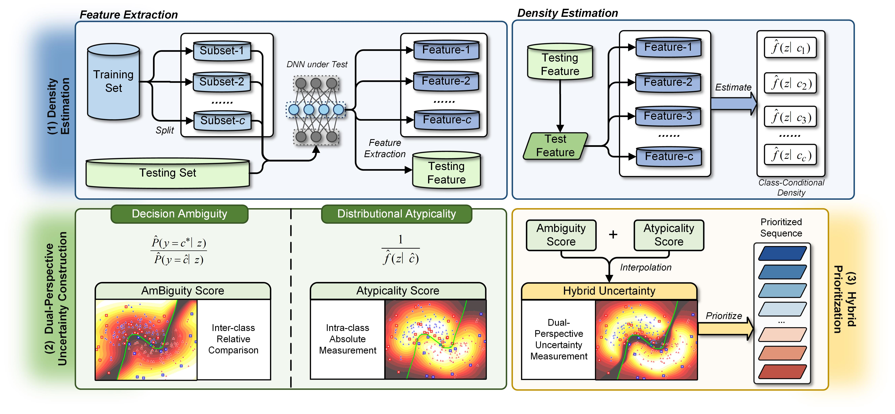
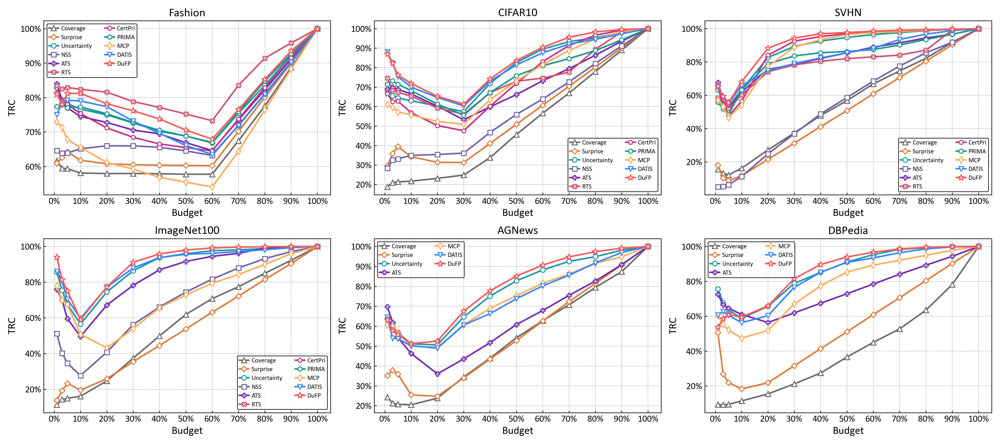
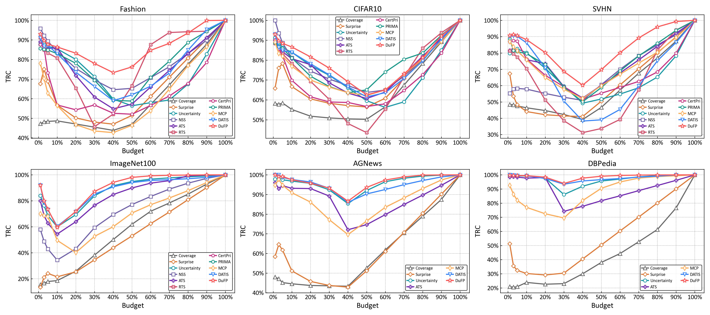
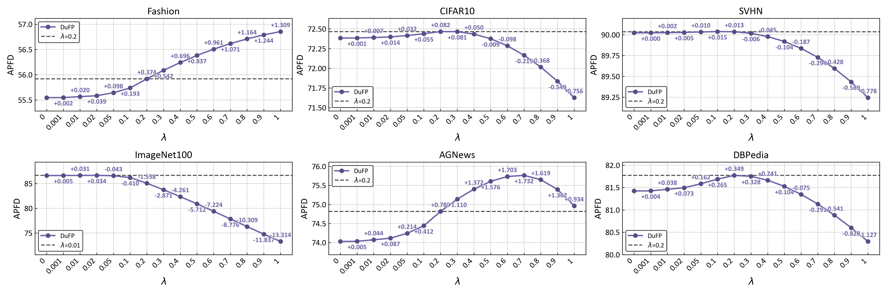
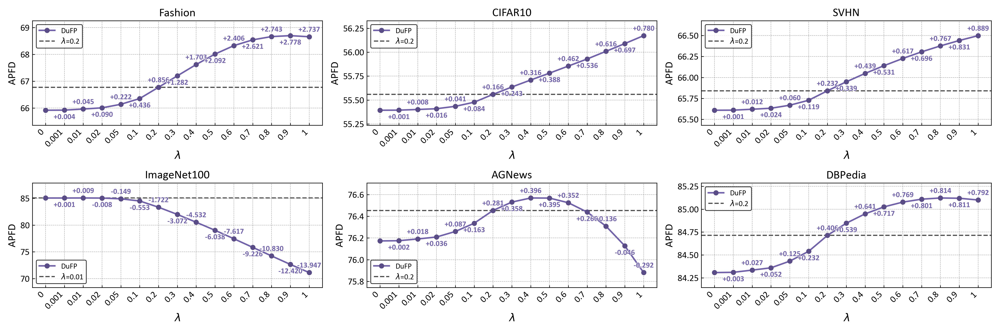
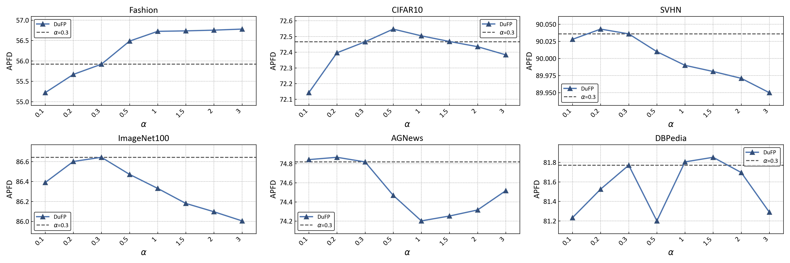
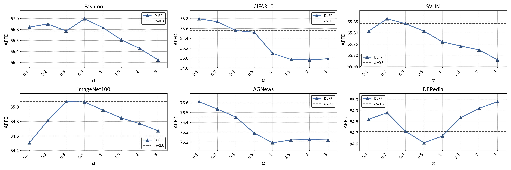

# DuFP - Official Implementation

[](https://conf.researchr.org/track/ase-2026/ase-2026-research-track) [](https://doi.org/10.1145/3832783.3834351) [](https://github.com/Ryan-LHR/DuFP) [](https://doi.org/10.5281/zenodo.19184935)

This repository contains the implementation of DuFP, a test input prioritization method for DNNs proposed in our paper: 
**When Ambiguity Meets Atypicality:  Dual-Perspective Test Input Prioritization for DNNs. [ASE 2026]**

[Paper: to be released after the review process.](not published now)

<p align="center">
  
</p>

## Structure

```text
DuFP/
├── baselines/  # implementation of baseline methods
├── configs/  # Configuration files
│   └── rq1.toml
├── data/  # Data storage
│   ├── datasets/
│   └── models/
├── main/
│   ├── main.py
│   ├── parse.py
│   └── run_rq1.py  # Used to run experiments
├── utils/
│   ├── candidate/  # Candidate set construction
│   ├── dufp/  # Core modules of DuFP
│   ├── load_data/  
│   ├── models/  # Model definitions
└── environment.yml
```


## Datasets and Models

All pretrained DNN models and datasets are available in this Zenodo dataset (provided in `.rar` archive format).

Before running the project, please extract all downloaded `.rar` files from [Our Artifacts on Zenodo.](https://zenodo.org/records/19184936) and then place the extracted contents into the following folders in the repository:

- `data/datasets/` — for storing datasets  
- `data/models/` — for storing pretrained model files

## Setup

##### Configuration
DuFP was implemented in **Python 3.8.10** and **PyTorch 1.12.0**. We conducted our experiments on a 64-bit Ubuntu 20.04 server with an Intel Xeon Platinum 8458P CPU, an RTX 4090 GPU, and 120 GB of memory. 

##### Install Dependencies
``` bash
conda env create -f environment.yml
conda activate test_selection
```


##  Usage

The work directory is `DuFP/main`.

#### Step 1: Configure arguments

Edit `configs/rq1.toml` to specify the methods and models to be evaluated. Available choices can be found in the corresponding `.toml` file. 
##### Example
```python
methods = [
    "nac-ctm","nac-cam","lsa","pc-lsa",  # coverage-based methods
    "deepgini","maxp","margin","entropy",
    "mcp_official","datis","datis_no_selection",
    "fast","ats", "rts","certpri"
    "dufp"  # our proposed method!
    "dufp_lam(0.1)",  # ablation for lambda
	"dufp_alpha(0.1)",  # ablation for alpha
	"dufp_dens(kde)",  # ablation for density estimation method
]  # and so on

models = ["FM-ResNet20","C10-ResNet20","SVHN-VGG16","IM100-deit_base_patch16_224","AGNews-Bert","DBPedia-Bert_base_uncased"]

cand_types = ["nominal","corrupted","adversarial"]
```

#### Step 2: Run experiments

 Run `python run_rq1.py` in work directory.

#### Tip

It should be noted that `run_rq1.py` does not only include the experiments for **RQ1**. Instead, the entire workflow is integrated into this script, including prioritization performance evaluation (**RQ2**), efficiency evaluation (RQ3), and ablation studies (**RQ4**). 

The **TRC** and **Time Cost** metrics are also reported together with APFD after the execution is completed. The DuFP variants used in the ablation study can be configured in `rq1.toml` by adjusting the `methods` parameter, where sufficient examples are provided.

**If you encounter any issues during implementation, please feel free to contact us.**

## Test New DNN Models

To evaluate a new DNN model using our method, configure the following components:

1. **Specify model information**  
   In `parse.py`, add the model name, model storage directory, and the corresponding dataset name.

2. **Add dataset loading logic**  
   In `load_data.py`, implement the loading procedure for the new dataset, including any required preprocessing steps.

3. **Define the target feature space**  
   In `dufp.py`, set the `layer_name` corresponding to the model’s penultimate layer.  
   This layer serves as the target feature space for DuFP.

After these configurations, the new model can be tested in the same way as the existing ones.

## Supplementary
### Selection Performance (RQ2)

The TRC results under the corrupted and adversarial settings are presented below. As shown in the figures, our proposed method consistently detects the most misclassifications in most cases, even under corrupted and adversarial distribution shift settings. This observation is consistent with the results reported in RQ2.

#### Corrupted

<p align="center">
  
</p>

#### Adversarial
<p align="center">
  
</p>


### $\lambda$ sensitive  (RQ4-A)

The APFD performance of DuFP with different $\lambda$ values under the corrupted and adversarial settings is presented below. As shown in the figures, the performance under both distribution shift settings exhibits similar fluctuation trends to the nominal setting. The default value of $\lambda = 0.2$  for most datasets and $\lambda = 0.01$ for ImageNet-100  continues to achieve stable performance across datasets and all three distribution settings (nominal, corrupted, and adversarial). 


#### Corrupted

<p align="center">
  
</p>

#### Adversarial
<p align="center">
  
</p>


### $\alpha$ sensitive (RQ4-B)

The APFD performance of DuFP with different $\alpha$ values under the corrupted and adversarial settings is presented below. As shown in the figures, the performance under both distribution shift settings exhibits similar fluctuation trends to the nominal setting, displaying a convex pattern on image datasets and a concave pattern on text datasets. The default value of $\alpha = 0.3$ continues to achieve stable performance across datasets and all three distribution settings (nominal, corrupted, and adversarial).

#### Corrupted

<p align="center">
  
</p>

#### Adversarial
<p align="center">
  
</p>


## Citation

```bibtex
@article{dufp,
  title        = {To be updated},
  author       = {To be updated},
  journal      = {To be updated},
  year         = {2026},
  note         = {Paper information will be added after publication}
}
```
